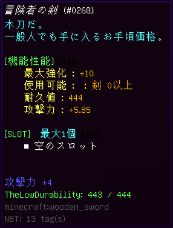

# TheLowDurabilityDisplay
TheLowの武器や防具の耐久値を確認できるようにするMod 
対応バージョンはForge1.8.9です。(Forge 1.8.9-11.15.1.2318-1.8.9で動作確認)

## 導入
modsフォルダーにjarファイルを入れてください。

## 使い方
武器や防具の耐久が少しでも減っている場合、アイテムの説明欄に残りの耐久値と最大耐久値が表示されます。 

